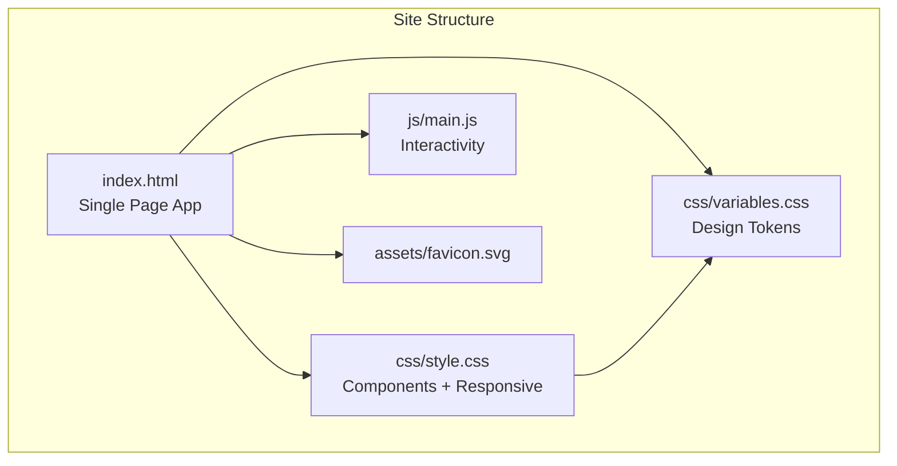
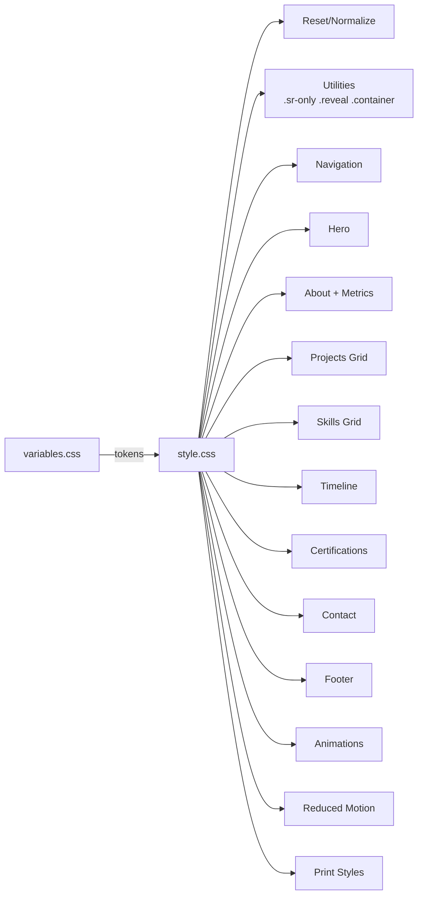
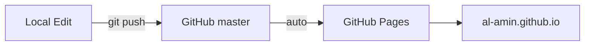

# al-amin.github.io

Personal portfolio — AI Engineer | MCP Architect | GenAI Platform Builder

**Live**: [al-amin.github.io](https://al-amin.github.io)

## Architecture



### Sections

| # | Section | Key Content |
|---|---------|-------------|
| 1 | Nav | Fixed top, blur backdrop, hamburger mobile menu |
| 2 | Hero | Typing effect (3 titles), CTAs, social links |
| 3 | About | Bio + 6 metric cards |
| 4 | Projects | 5 project cards with tech pills + metrics |
| 5 | Skills | 5 categories with skill pills |
| 6 | Experience | Vertical timeline, 6 roles |
| 7 | Certifications | 6 cert cards |
| 8 | Contact | Email, LinkedIn, GitHub, availability |
| 9 | Footer | Copyright, socials, back-to-top |

## CSS Architecture



## Deployment



Push to `master` → auto-deploys via GitHub Pages in ~1-2 min.

## Tech Stack

- **HTML5** — Semantic landmarks, JSON-LD, Open Graph, ARIA
- **CSS3** — Custom properties, Grid, Flexbox, mobile-first responsive
- **Vanilla JS** — IntersectionObserver, typing effect, focus trap
- **Google Fonts** — Inter + JetBrains Mono (`font-display: swap`)
- **Zero dependencies** — no npm, no build step, no frameworks

## Design

- Dark navy (`#0a0f1c`) + teal accent (`#00BFA6`)
- Mobile-first: 640px → 768px → 1024px → 1280px
- `prefers-reduced-motion: reduce` support
- Print stylesheet

## Performance Budget

| Metric | Target |
|--------|--------|
| Page weight (excl. fonts) | < 75KB |
| Lighthouse Performance | 95+ |
| Lighthouse Accessibility | 100 |
| Lighthouse SEO | 100 |
| Lighthouse Best Practices | 100 |

## Local Development

```bash
python3 -m http.server 8000
# Open http://localhost:8000
```

## Content Updates

Content source of truth: `alamin-resume-related/profile/master_resume.md`

1. Edit content in source repo
2. Update `index.html` sections
3. Push to master

## License

MIT
